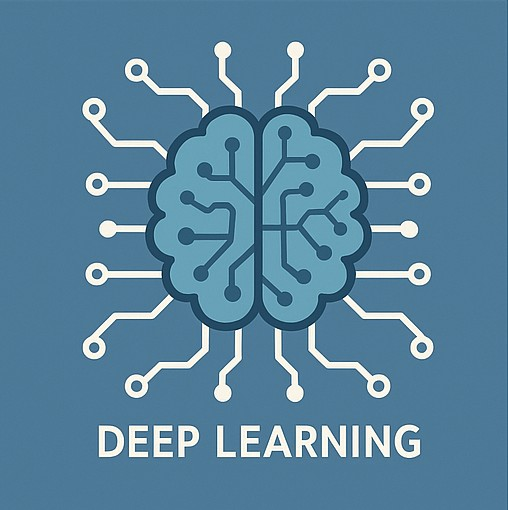

# Data Scientist

#### Technical Skills: Python, SQL, SAS, Docker, Git, MLflow, Streamlit, Tensorflow, Pytorch, Tableau, PowerBI, NLP

## Education
- Ph.D., Data Science and Analytics | North Carolina A&T State University (Expected: May 2026)								       		
- M.S., Mathematics	| University Of Ilorin (_December 2015_)	 			        		
- B.S., Mathematics | University Of Ilorin (_July 2013_)

## Work Experience
**Data Science Research Assistant @ North Carolina A&T State University (_August 2022 - Present_)**
- Developed ensemble machine learning models achieving 99.4% accuracy in landslide susceptibility mapping
- Researched causal inference techniques in disaster management and built knowledge graphs for evacuation systems
- Applied unsupervised deep learning techniques for change detection and computer vision supervised segmentation models for landslide detection

**Commercial Data Analyst @ FrieslandCampina WAMCO (_Feb. 2020 - Dec. 2021_)**
- Effectively monitored a credit control system with the supervision of the commercial control manager and in collaboration with sales, finance, and executive team members to drive above 96% of payment-to-invoice ratio in 2021.
- Automated customer payment analysis using data that increased revenue by 20% in 2020
- Optimized forecasting & demand planning, improving cash flow and credit risk mitigation

**Business Support Analyst @ FrieslandCampina WAMCO (_Jan. 2017 - Jan. 2020_)**
- Optimized Operational Performance: Analyzed and reported KPIs, increasing line per call (11→15), callage (20→26), and achieving a 100% strike rate
- Enhanced Data Integrity & Field Execution: Identified performance gaps, implemented corrective actions, and ensured data accuracy within the Distribution Management System (DMS) database

## Projects
### Optimized machine learning models for landslide susceptibility mapping
[Publication](https://www.sciencedirect.com/science/article/pii/S1574954124001250)

Landslides present a substantial risk to human lives, the environment, and infrastructure. Consequently, it is crucial to highlight the regions prone to future landslides by examining the correlation between past landslides and various geo-environmental factors. This study aims to investigate the optimal data selection and machine learning model, or ensemble technique, for evaluating the vulnerability of areas to landslides and determining the most accurate approach. To attain our objectives, we considered two different scenarios for selecting landslide-free random points (a slope threshold and a buffer-based approach) and performed a comparative analysis of five machine learning models for landslide susceptibility mapping, namely: Support Vector Machine (SVM), Logistic Regression (LR), Linear Discriminant Analysis (LDA), Random Forest (RF), and Extreme Gradient Boosting (XGBoost). The study area for this research is an area in Polk County in Western North Carolina that has experienced fatal landslides, leading to casualties and significant damage to infrastructure, properties, and road networks. The model construction process involves the utilization of a dataset comprising 1215 historical landslide occurrences and 1215 non-landslide points. We integrated fourteen geospatial data layers, consisting of topographic variables, soil data, geological data, and land cover attributes. We use various metrics to assess the models' performance, including accuracy, F1-score, Kappa score, and AUC-ROC. In addition, I used the seeded-cell area index (SCAI) to evaluate map consistency. The ensemble of the five models using Weighted Average produces outstanding results, with an AUC-ROC of 99.4% for the slope threshold scenario and 91.8% for the buffer-based scenario. Our findings emphasize the significant impact of non-landslide random sampling on model performance in landslide susceptibility mapping. Furthermore, by optimally identifying landslide-prone regions and hotspots that need urgent risk management and land use planning, our study demonstrates the effectiveness of machine learning models in analyzing landslide susceptibility and providing valuable insights for informed decision-making and disaster risk reduction initiatives.

### Edu-Navigator Chatbot: AI-powered chatbot for HBCU students using 

Used **Python and Prompt engineering** to fine-tune the GPT-3.5 turbo engine to develop the Edu Navigator Chatbot for HBCU students to navigate through their education journey. We designed the chatbot to help guide students through their educational journey by providing personalized advice, resources, and answers to common questions related to academics, campus life, and student services. By leveraging Python for the back-end development and fine-tuning the model with specific prompts, the chatbot was able to offer targeted, relevant, and user-friendly assistance to enhance the student experience.

## Awards and Honors
- North Carolina ArcGIS Users’ Graduate Academic Excellence Award  - 2024                                                                                             
- HP Future of Work Academy (FOWA) Challenge Winner - 2024                                                                                                                                   
- Thermo Fisher Scientific Innovation Challenge (First Position) - 2024                                                                                                          

## Publications
1. Agboola, G., Beni, L. H., Elbayoumi, T., & Thompson, G. (2024). Optimizing landslide susceptibility mapping using machine learning and geospatial techniques. Ecological Informatics, 81, 102583.
2. Isiaka, A. B., Anakwenze, V. N., Ilodinso, C. R., Anaukwu, C. G., Ezeokoli, C. M. V., Noi, S. M., ... & Adonu, R. M. (2024). Harnessing artificial intelligence for early detection and management of infectious disease outbreaks. International Journal of Innovative Research and Development, 13, 52-65.
3. Ogunmiloro, O. M., Obayomi, A. A., & Agboola, G. O. (2024, April). The menace of ghost workers, job racketeers, and creators of online job offer scam sites on unemployment in Nigeria: a mathematical model analysis and control. In Operations Research Forum (Vol. 5, No. 2, p. 34). Cham: Springer International Publishing.
4. Agboola, G., & Beni, L. H. (2023, December). A Comparative Study of Machine Learning Algorithms for Landslide Susceptibility Assessment. In AGU Fall Meeting Abstracts (Vol. 2023, pp. NH03-07).
5. Agboola, G., & Beni, L. H. Evaluating Deep Learning Object Detection Algorithms for Landslide Detection. AGU24.

- [Data Science Blog](https://medium.com/@agboolagazal)
